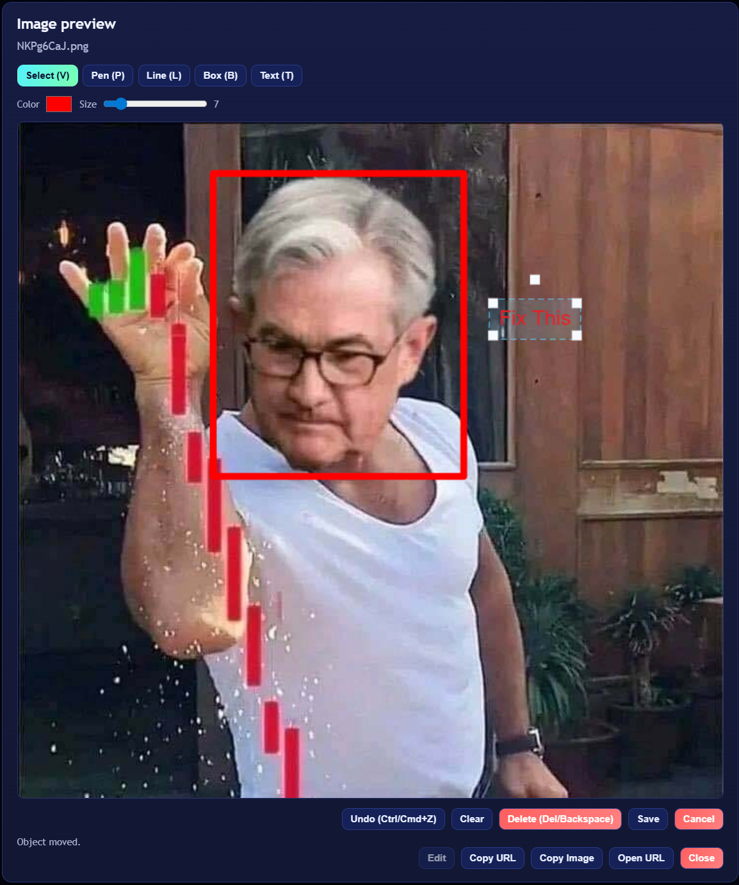

# quick-clip

`quick-clip`은(는) 이미지를 빠르게 업로드하고 클립보드로 공유할 수 있는 웹 기반 툴입니다.  
직접 업로드한 이미지 URL을 즉시 복사하고, 갤러리에서 이미지 관리도 가능합니다.

## 실행 방법

관리 스크립트로 실행합니다.

```bash
./manage.sh install    # 처음 실행: 가상환경 생성 및 의존성 설치
./manage.sh setup      # .env.example을 복사해 .env 생성
./manage.sh start      # quick-clip을 백그라운드로 실행
```

`manage.sh`에서 다음 명령을 제공합니다.

```bash
./manage.sh status     # 앱 실행 상태 확인
./manage.sh logs       # 로그 보기 (`tail -f app.log`)
./manage.sh stop       # 백그라운드 프로세스 중단
./manage.sh restart    # 서비스 재시작
./manage.sh help       # 전체 사용법 출력
```

`main.py`는 `.env` 값을 자동으로 읽습니다.

`manage.sh`를 통해 애플리케이션을 시작하고 관리하는 것을 권장합니다.

## 주요 기능

- 파일 업로드
  - 파일 선택 업로드 및 드래그 앤 드롭 업로드 지원
- 복사
  - 이미지 URL 복사
  - 이미지 데이터(바이너리) 클립보드 복사
- 이미지 미리보기 갤러리
- 최근 업로드
  - 최신 업로드 목록 표시
- 갤러리 관리
  - 페이지네이션(`Load more`)
  - 다중 선택 삭제
  - 다중 선택 삭제 확인 모달
  - 모바일 대응 UI
- 백엔드에 `/purge` 엔드포인트가 있지만, UI 기본 흐름은 다중 선택 삭제 기반입니다.

## API 엔드포인트

- `POST /upload`: 이미지 업로드 후 URL 반환
- `GET /s/{filename}`: 이미지 제공
- `GET /list`: 저장된 이미지 목록 조회 (`?limit=<n>&offset=<n>`)
- `DELETE /s/{filename}`: 단일 이미지 삭제
- `POST /purge`: 전체 이미지 삭제
- `GET /health`: 헬스체크

별도 CLI 실행 스크립트는 필요하지 않습니다.

## 스크린샷


## 이미지 편집기
- 이미지 미리보기 모달에서 바로 편집 가능
  - 도구: 브러시(P), 선(L), 사각형(B), 텍스트(T), 선택(V)
  - 객체 이동, 크기 조절, 회전
  - 선택 객체 삭제, 실행 취소, 편집 저장
  - 단축키는 툴/액션 버튼 라벨에 표시



