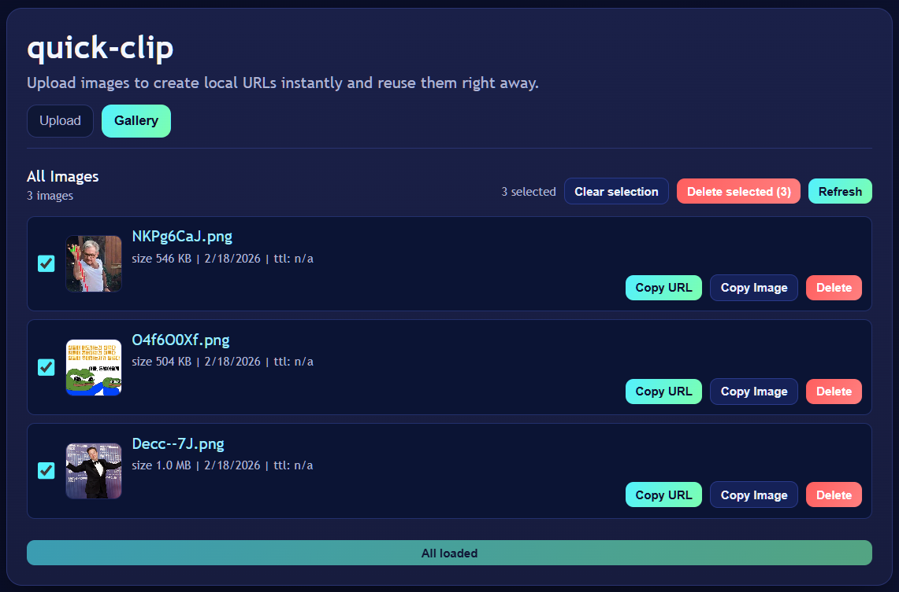

# quick-clip

`quick-clip` is a web-based quick clipboard for images.  
Upload, copy URL/image to clipboard, and manage stored images from a simple gallery UI.

한국어 문서는 [README.ko.md](./README.ko.md)에서 확인할 수 있습니다.

## Run

Start the server with one command:

```bash
python main.py
```

`main.py` reads `.env` values automatically:

- `LOCAL_BUCKET_HOST` (default: `127.0.0.1`)
- `LOCAL_BUCKET_PORT` (default: `8000`)
- `LOCAL_BUCKET_DIR` (default: `./bucket`)
- `LOCAL_BUCKET_STATIC` (default: `./static`)
- `LOCAL_BUCKET_ALLOWED_PREFIXES` (default: `image/`)
- `LOCAL_BUCKET_MAX_BYTES` (default: `10485760`)
- `LOCAL_BUCKET_TTL_SECONDS` (default: `0`)
- `LOCAL_BUCKET_MAX_FILES` (default: `0`)
- `LOCAL_BUCKET_RELOAD` (default: `false`)

For reload during local development:

```bash
LOCAL_BUCKET_RELOAD=true
```

## Features

- Upload image files via file picker or drag-and-drop.
- Generate direct local URLs for quick sharing and clipboard copy.
- Copy:
  - image URL
  - binary image data (image clipboard)
- Preview uploaded images in a gallery.
- **Latest uploads** panel for quick recent-file confirmation.
- **Gallery management**:
  - pagination with `Load more`
  - multi-select delete
  - bulk delete confirmation
  - mobile-friendly layout for gallery actions
- `/purge` endpoint exists on backend, but the UI keeps multi-select delete as the main bulk deletion flow.

## Endpoints

- `POST /upload`: Upload image and receive URL
- `GET /s/{filename}`: Serve image
- `GET /list`: List stored images (supports `?limit=<n>&offset=<n>`)
- `DELETE /s/{filename}`: Delete an image
- `POST /purge`: Remove all stored images
- `GET /health`: Health check

No separate CLI launcher script is required.

## Screenshots



